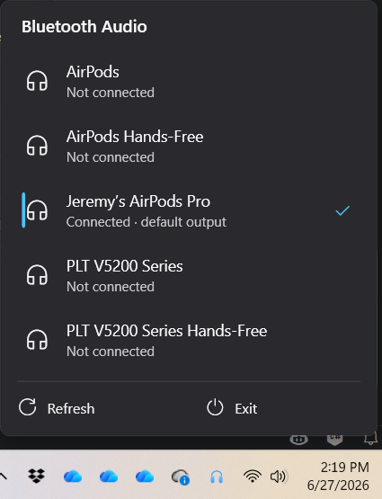

# BT Audio Tray

A Windows 11 system-tray tool for one-click connecting Bluetooth audio devices
(AirPods, etc.) **and** switching the default audio output in a single action —
something the stock Windows UI makes tedious.

<p align="center">
  
</p>

## What it does

- Lives in the notification area with a state-aware headphones icon (blue =
  something connected, grey = nothing connected).
- Click the icon to open a modern flyout listing your Bluetooth audio devices.
- Click a device to **connect it and make it the default output** in one step.
  Click a connected device to disconnect it.

## How it works

The hard parts of this problem and how they're solved:

- **Connecting Bluetooth audio** ([BluetoothManager.cs](BluetoothManager.cs)):
  Windows has no clean public API to connect a paired BT audio device, and the
  Bluetooth-stack approaches (WinRT RFCOMM nudge, `BluetoothSetServiceState`)
  proved unreliable — the link drops and A2DP never engages. Instead this talks to
  the **audio driver** via Kernel Streaming: it walks the audio endpoint's device
  topology to the driver's KS filter and sends `KSPROPERTY_ONESHOT_RECONNECT`
  (`KSPROPSETID_BtAudio`). This is the mechanism ToothTray uses and is the reliable
  path. The same KS property set is also used to identify which endpoints are
  Bluetooth audio devices.

- **Switching the default output** ([AudioManager.cs](AudioManager.cs)): uses the
  undocumented `IPolicyConfig` COM interface (the same one the Sound control panel
  uses), setting the endpoint as default for the Console, Multimedia, and
  Communications roles.

- **UI**: WPF flyout ([FlyoutWindow.xaml](FlyoutWindow.xaml)) styled after the
  Windows 11 Bluetooth panel; a WinForms `NotifyIcon` provides the tray presence
  (WPF has no native tray support). Orchestrated by [TrayApp.cs](TrayApp.cs).

## Build & run

Requires the .NET 10 SDK on Windows.

```sh
dotnet build
dotnet run        # or run bin/Debug/net10.0-windows10.0.19041.0/BTAudioTray.exe
```

Click the tray icon to open the flyout. To stop the app: open the flyout → **Exit**.

## Install & run at startup

Publish a release build and copy it somewhere permanent, then register it to launch
at login via the per-user `Run` key (no admin required):

```powershell
# Publish a framework-dependent build (needs the .NET 10 runtime installed)
dotnet publish -c Release -r win-x64 --self-contained false -o publish

# Install to LocalAppData
$dest = "$env:LOCALAPPDATA\BTAudioTray"
Remove-Item $dest -Recurse -Force -ErrorAction SilentlyContinue
Copy-Item publish $dest -Recurse

# Register to start with Windows
Set-ItemProperty "HKCU:\SOFTWARE\Microsoft\Windows\CurrentVersion\Run" `
    -Name BTAudioTray -Value "`"$dest\BTAudioTray.exe`""

# Launch now
Start-Process "$dest\BTAudioTray.exe"
```

To remove the auto-start entry:

```powershell
Remove-ItemProperty "HKCU:\SOFTWARE\Microsoft\Windows\CurrentVersion\Run" -Name BTAudioTray
```

## Status

Working: device discovery, reliable connect/disconnect, verified default-output
switching, state-aware icon, modern flyout UI, run-at-startup (manual install above).

Possible future work: an in-app "Start with Windows" toggle and an install script.

## Acknowledgments

The reliable Bluetooth-audio connect approach (driver-level Kernel Streaming
`KSPROPERTY_ONESHOT_RECONNECT`) is based on
[ToothTray](https://github.com/m2jean/ToothTray) by m2jean.

## License

[MIT](LICENSE) © Jeremy Leff
